# TXT

> Semantic Bitcoin Storage


TXT (Transaction Tape) is a portable Bitcoin transaction storage system which lets you store, manage, and share bitcoin transaction bundles with semantic metadata attached.

---

# What is it?

Just like how [Content Management Systems (CMS)](https://en.wikipedia.org/wiki/Content_management_system)  provide an easy way to store and manage content, TXT provides an easy way to store, organize, and mange Bitcoin transactions through semantic metadata.

Simply save bitcoin transaction IDs or raw transactions to your TXT, and you immediately get all the powerful features for your transaction collection right out of the box, such as:

1. Transaction Explorer and Search Engine
2. READ/WRITE HTTP API
3. Auto-sync with Miner API
4. Instant data feed channels
5. Portable backup storage
6. More...


---

# Examples

Check out some examples:

1. [Bitpic.txt](https://txt.bitpic.network): A TXT node for [Bitpic](https://bitpic.network)
2. [C.txt](https://c.planaria.network): A Bitcoin File Search Engine, powered by TXT.


---

# Architecture

## 1. Data Structure


TXT adds a semantic layer to Bitcoin transactions.

Prior to TXT, searching for bitcoin transactions was limited to utilizing the transaction data itself (such as transaction ID or push data filters).

With TXT, transactions can be wrapped and indexed with ANY semantic metadata, introducing a whole new dimension to organizing and sharing bitcoin transactions, something not possible with just pure, raw transactions.

**The semantic layer can be used to encode:**

- intent
- filter
- trigger
- privacy
- ephemerality
- non-determinism
- structure
- and various other features which can ONLY exist as metadata (data about data).

For example, you may want to create and/or share a bundle of transactions enclosing encrypted content. With the semantic metadata, you can keep the content encypted while still being able to describe the transaction bundle as: "these encrypted gibberish transactions are actually all my emails".

## 2. Components

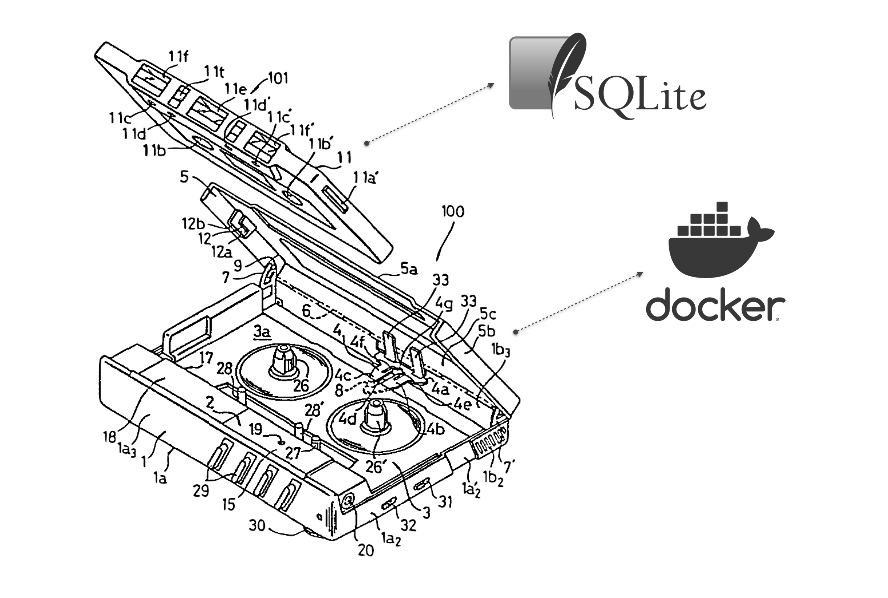

TXT is made up of two components:

1. **Tape**: Portable storage format, powered by [SQLite](https://www.sqlite.org/index.html)
2. **Container**: TXT tape player/recorder, powered by [Docker](https://www.docker.com/)

Creating a TXT tape is like creating an infinite playlist. Just like how you create a playlist by adding songs, you can create a TXT tape by adding transactions, which is as easy as a simple HTTP POST request.

Through the built-in HTTP GET API, the tape can be read even as it's being written (via POST API) or exported and shared as a portable SQLite file.

## 3. Operation

How does TXT fit into the greater Bitcoin ecosystem?

TXT was designed to be a neutral storage format that can seamlessly integrate into the rest of the ecosystem. Here's an overview:


1. **Transaction Source**
   1. **Wallets**: push a transaction to TXT to store it after the wallet has successfully sent it. Learn more [Here](https://blog.moneybutton.com/2020/03/30/handcash-and-money-button-restore-peer-to-peer-electronic-cash/) and [Here](https://medium.com/@handcash/bringing-back-peer-to-peer-to-bitcoin-a-joint-announcement-by-handcash-and-money-button-e2b25b71dd9d).
   2. **API Providers:** send crawled transactions to TXT
2. **Transaction Processor**
   1. **Miners**: Synchronize transaction confirm status with TXT through Merchant API.	
3. **Transaction Consumer**
   1. **Backup**: store TXT tape anywhere as an archive
   2. **Agents**: use the TXT API to fetch data
   3. **Apps**: use TXT as the single source of your application, crawl TXT to build your backend.
   4. **You**: use TXT as a personal transaction management system
   5. **Peer TXT:** export TXT tape and share with other peers.


---

# Overview

## 1. Transaction Management System

Let's take a look at how you can manage transactions using TXT.

### a. Like a File System

The TXT Transaction Management System is like a file system but for bitcoin transactions. A typical file system lets you:

1. store files
2. store metadata for each file
3. search and sort files by attached metadata
4. explore all this with an easy to use explorer
5. easily access the stored files from applications
6. easily export files to another machine

For example, here's what a file explorer looks like:

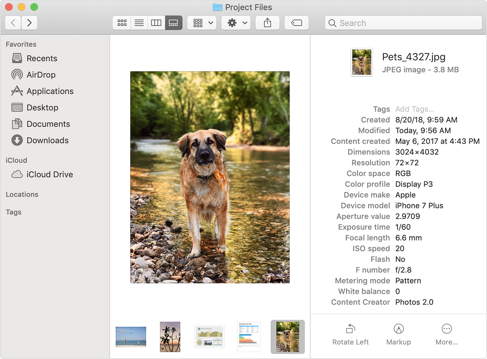


TXT is like that, but for bitcoin transactions. 


### b. Displaying Semantic Metadata

TXT stores, indexes and displays your transactions in a comprehensive manner:

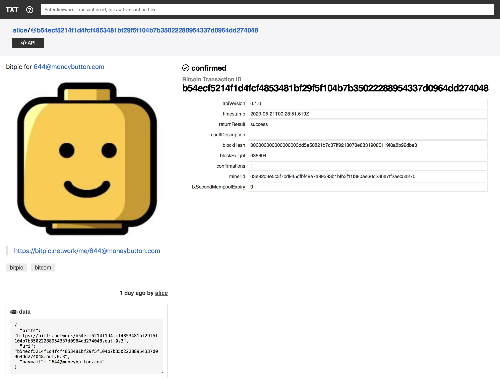

**TXT is a semantic storage**, which means it attaches and displays rich semantic metadata to bitcoin transactions, such as the image, and associated content.

There are two ways TXT attaches semantic metadata to transactions.

1. **Via API:** You can directly attach metadata to transactions when you store them to TXT.
2. **Automatically**: Given a transaction ID, TXT automatically synchronizes with Bitcoin miners via Miner API to determine the confirm status, and the cryptographically attested status information to each transaction.

### c. Semantic Indexing and Filtering

It doesn't stop at simply displaying the metadata. The real power of TXT Transaction Management System comes from being able to semantically organize, browse, and search the stored transactions based on the attached metadata, just like a file explorer:

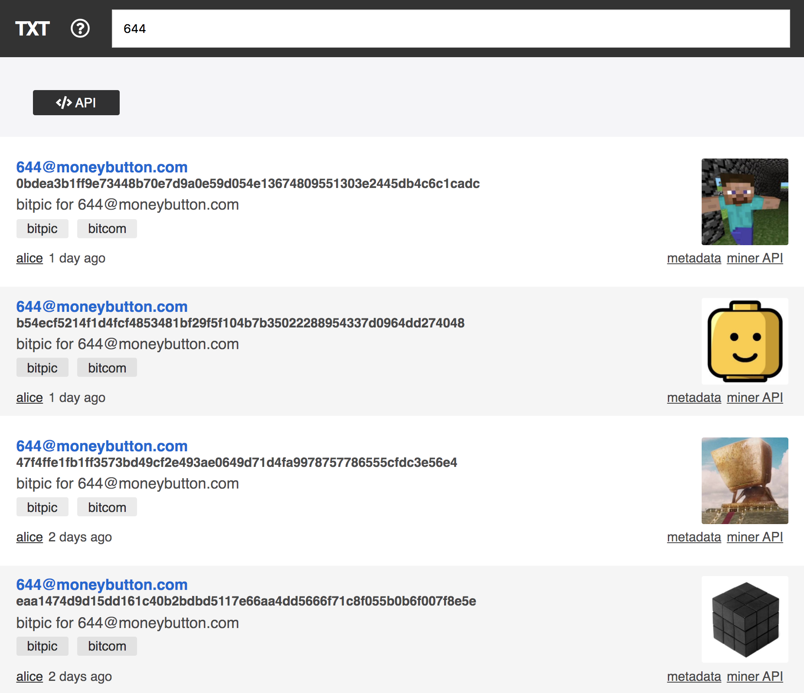

Unlike a typical file system that lets you create multiple layers of folders, TXT has only **one top level category (channels)**, complemented by an additional dimension of data structure called **"tags", which lets you organize your transactions using ["many to many"](https://en.wikipedia.org/wiki/Many-to-many_(data_model)) semantic relationships**.

Combined, these two features are powerful enough that you don't even need additional coding to build your own custom database. You can create your own custom schema by simply adding tags or categories to your transactions.

## 2. Semantic Transaction API

### a. Write API

Writing to TXT is as easy as making an HTTP POST request. Here's an example:

```js
/***********************************************************************************************
*
* 1. Store the transaction ID 5e696db21c57cef74c439ba2d30563e29c11f50f7c492fc0f653c6fa54a77c85
* 2. under "planaria" channel
* 3. Tag it as "bitpic" and "bitcom"
* 4. attach metadata (will be full text indexed)
* 5. attach arbitrary data which will be returned by the instant API
*
***********************************************************************************************/
axios.post("http://localhost:3013/api", {
  channel: "planaria",
  set: {
    "5e696db21c57cef74c439ba2d30563e29c11f50f7c492fc0f653c6fa54a77c85": {
      tags: ["bitpic", "bitcom"],
      meta: { title: title, description: description, content: content, image: image },
      data: { paymail: title, bitfs: image }
    }
  }
})
```

You can either store:

1. Bitcoin transaction ID only
2. Bitcoin transaction ID AND its raw transaction hex

And finally, you can attach additional semantic metadata which will make it easy to retrieve and filter transactions later, either through the explorer or through the API:

- **meta:** for humans. used to display the card UI in the explorer.
- **data:** for machines. can attach arbitrary JSON and will be returned by the built-in API.
- **tags:** tag array


### b. Read API

TXT provides an HTTP API to read from the database. Here's an example API response:

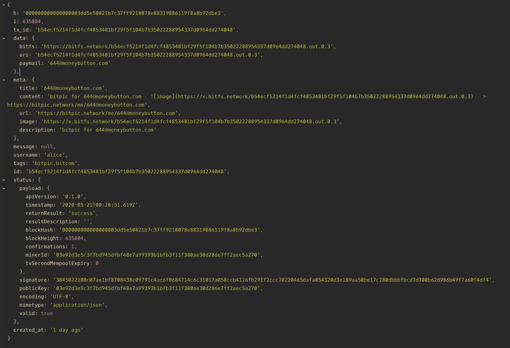

Note: It is possible to use the TXT READ API to power your end user facing application directly, but you can also build a separate user-facing application database which is constructed by crawling the TXT tape.

## 3. Transaction Storage Format

TXT was designed with portability in mind. Everything should be easily shared in a distributed manner, from the underlying data storage to the engine itself.

### a. Portable Tape

**TXT uses SQLite as its storage system.** SQLite is the most popular [serverless database system](https://www.sqlite.org/serverless.html) which can support all kinds of use cases, from powering mobile apps to embedded devices to browser localstorage to a cache for enterprise data. 

The TXT explorer provides a way to download the entire TXT database as a single file:


When you click download, you will see that you are not simply "downloading" some JSON API response, but the entire sqlite database file:

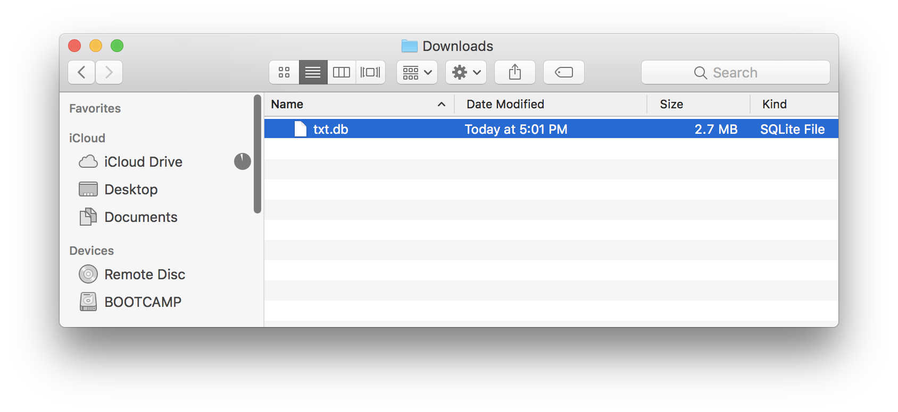

> You can try downloading an example txt.db here: https://txt.bitpic.network

The file based form factor makes the storage ultra portable. You can share a TXT archive over email, post it to GitHub, store it on a USB drive, or share it anywhere. And it can then be opened by any SQLite client, or [any programming language](https://github.com/search?q=sqlite), on any platform. (And of course, you can instantly take the exported TXT archive and plug it into another TXT client)

Here's an example where I download an entire Bitpic TXT ledger instantly, and then open it with a [Mac SQL client](https://tableplus.com/):

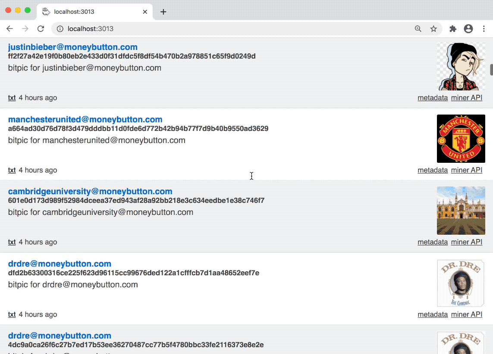

This way it becomes effortless to share transaction bundles in a distributed manner--you can even email the entire DB as an attachment!

### b. Portable Container

The TXT transaction management system is packaged as a Docker image, and you can easily spin them up as containers, on any platform.


Furthermore, all read/write operations are executed over local or remote HTTP requests, which means TXT containers can be easily plugged into any existing workflow, any platform, and any programming language environment. If you wish to restrict access, you can even put a reverse proxy in front of it to control access.


The unique combination of containerized engine (Docker) + containerized storage format (SQLite) means the **TXT archive can be used as a data exchange format among multiple parties.**

> TXT is **a storage system** and **storage format** at the same time. When you run a containerized TXT node, it is a storage system. But the underlying TXT tape database (txt.db) may be exported and replicated to another TXT host, in a distributed manner.

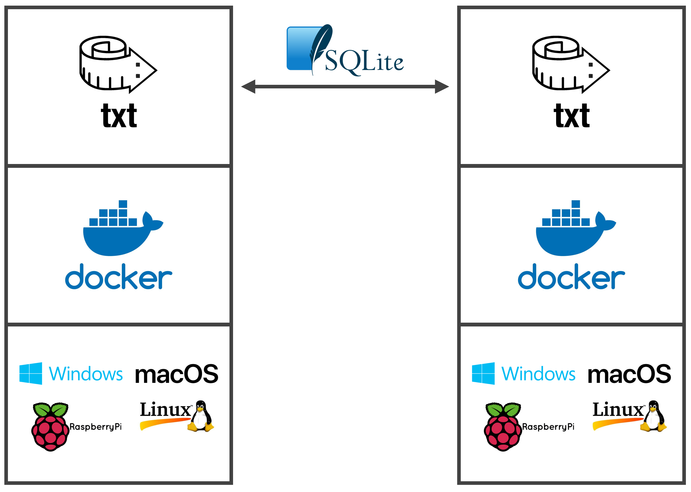

---

# Features

TXT ships with several powerful features you can instantly start using right out of the box. All you need to do is add transactions. Here's an overview:

## 1. Storage

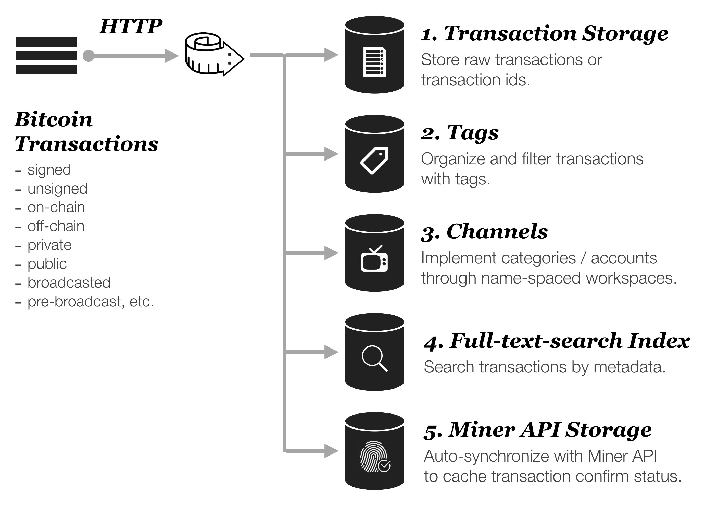

The main value-add of TXT comes from its ability to **attach and index semantic metadata on Bitcoin transactions.** 

Here's what TXT automatically builds for you as you start adding transactions:

1. **Transaction Storage:** You can store **full raw transaction** or **transaction ID only**.
   1. **Raw transaction:** Store the full raw transaction if you truly want to "own your own data". If you store the full raw transaction, you can recrawl and parse the raw transactions from TXT to construct all kinds of state machines without relying on a 3rd party.
   2. **Transaction ID:** Sometimes simply storing transaction IDs with metadata would be all you need. Even though you won't  have direct access to the full raw transaction, this is good enough for many cases where you want to only store minimal collection of "pointers" to the transactions you're interested in. As long as you have the collection of all your transaction IDs (pointers), you should be able to retrieve them in the future from various data providers.
2. **Tag Index:** TXT lets you organize your transactions into multiple tags. Each tag has its own API feed and a human readable explorer page (powered by the API). Thanks to the instant ["Many to Many" data structure](https://en.wikipedia.org/wiki/Many-to-many_(data_model)) provided by the tag structure, it is easy to organize your transactions in many different ways without writing any code. Instead of having to create your own database table, you can simply tag transactions to organize them in many different ways.
3. **Channel Index:** In addition to tags, TXT lets you organize transactions into "channels". Channels are compartmentalized workspaces for storing transactions, each with its unique namespace. You can use channels to create a workspace for each of your users. For example, you can send all transactions from Alice to Alice channel at `/alice`, and those from Bob to Bob channel at `/bob`. Alice should be able to see all her transactions at the path: `/alice` and Bob should be able to do the same at `/bob`. When combined with the tagging system you can implement a multi-dimensional organization system without having to write any code. For example you can create a data feed for Alice's photos by sending your transaction to Alice channel, tagged as "photos", which can be accessed at `/alice/photos`.
4. **Full text search index:** TXT automatically creates a full text search index on top of all the metadata you attach for your transactions, and exposes the index through its built-in explorer/search engine. You may use this internally or open it up to your end users either publicly or privately, basically providing a transaction explorer and search engine for your apps.
5. **Miner API Storage:** This will be discussed further below (see "Miner Cache"), but another powerful feature of TXT is that it automatically synchronizes with Miner APIs. For each transaction it stores, it fetches the transaction confirm status directly from the miners. It checks the confirmed/unconfirmed status until the transaction goes into "confirmed" state. Also TXT caches the entire API response back from the miner which includes the cryptographic signature for ensuring authenticity. The caching aspect is important since the confirm status gets merged into the database and can be served through a single API request, instead of having to request miners all the time. You only need to sync and cache once to get the cryptographically attested api response, and save traffic.


## 2. API


Populating the TXT database is easy.

On top of the SQLite database, the TXT Transaction Management System runs an HTTP endpoint which interprets incoming POST requests to write transactions to the storage. Because of this platform-independent design, TXT can be easily plugged into **any existing workflow**, **any platform** and **any programming language environment**.

As you start writing to TXT, TXT automatically indexes all the posted transactions into a database and provides a simple yet flexible API endpoint right out of the box.


## 3. Miner Cache

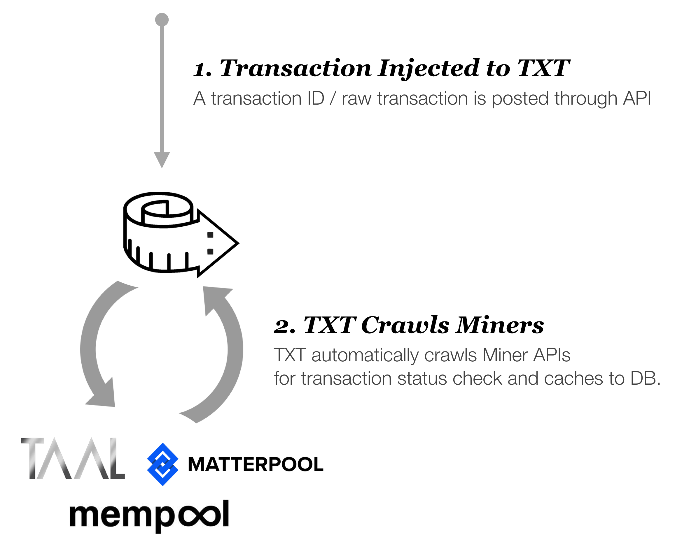

Many bitcoin developers are familiar with the concept of [Crawling the blockchain](https://docs.planaria.network/#/intro?id=bitcoin). The [Planaria Grid APIs](https://grid.planaria.network) such as [Bitbus](https://bitbus.network) and [Bitsocket](https://bitsocket.network) are constructed with this approach.

However, we are beginning to see the rise of another way to get the status of the blockchain, called ["Merchant API"](https://github.com/bitcoin-sv/merchantapi-reference). It's a minimal set of standardized APIs (often run by bitcoin miners) which can be used to efficiently read/write only the transactions that matter to you, without the need to interact with the entire blockchain. Instead of connecting to the Bitcoin peer network, you can directly connect to a merchant api provider and make a request, and they will process and respond with a cryptographically signed API response.

One important feature of a Merchant API is the [**"transaction confirm status" API**](https://github.com/bitcoin-sv-specs/brfc-merchantapi#query-transaction-status). When you make a request with a transaction ID, it gives you the **confirm status** of that transaction, along with the API provider's **cryptographic signature**. Here's what the response looks like:

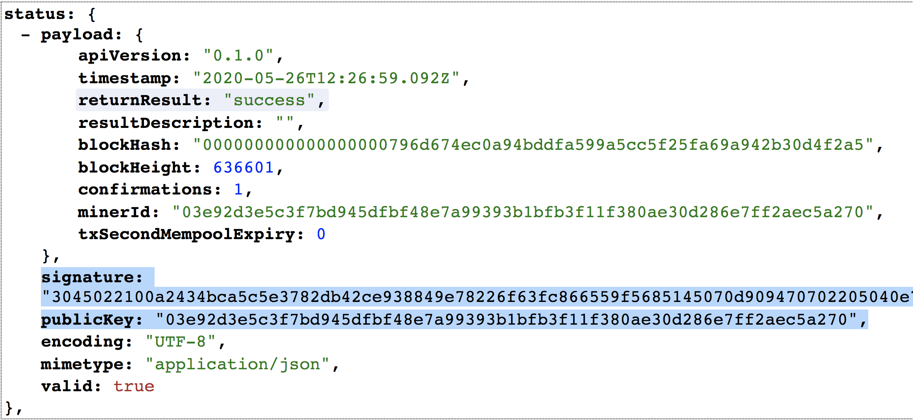

The API response is accompanied by the miner's cryptographic signature. A naive implementation would be to just make this request once, use the data, and forget.

But this is not ideal because you're throwing away valuable data--the cryptographic signature, the evidence--**if an API provider gave you incorrect data, you should be able to hold them accountable in the future.** The cryptographic signature is what allows that.

And this is where TXT comes in handy. **TXT caches the entire API response.**

To summarize, here's the workflow from an application developer's point of view:

1. You store a transaction to TXT
2. TXT automatically crawls miners until the transaction gets mined
3. When the transaction gets confirmed, the status gets auto-merged into TXT, instantly ready to be used via API.

The best part: You as a developer don't need to worry about any of this. All you need to do is store a transaction, and TXT takes care of the rest, and you will have an instant API that just works.

## 4. Explorer

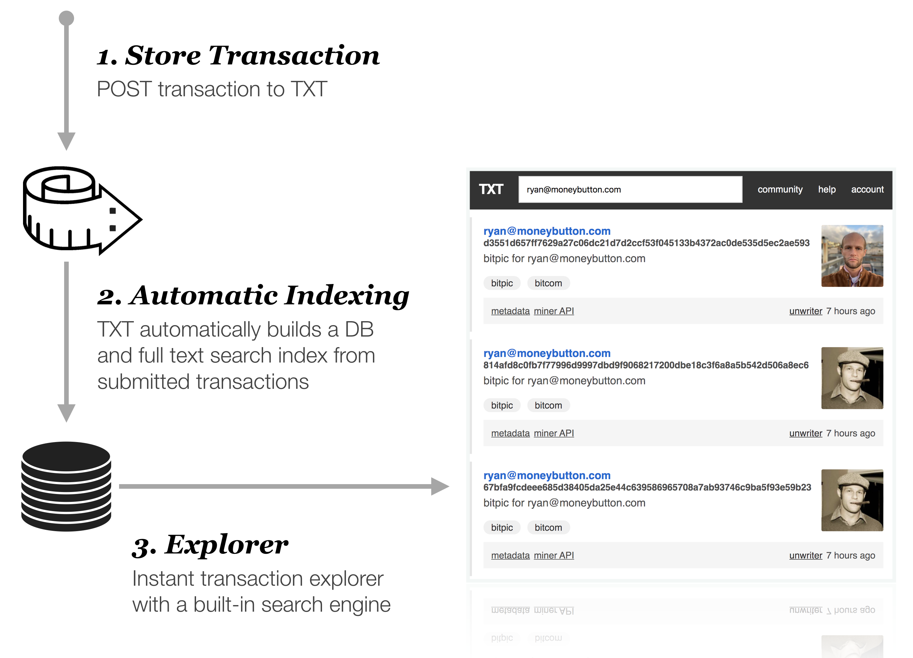

TXT ships with a powerful built-in explorer which automatically indexes and displays your transactions in whichever way you want. If you want to categorize transactions, you can simply tag them when you POST transactions to TXT. And TXT automatically maintains a full-text index on all your content, so you can easily search.

This transaction explorer is extremely helpful and flexible. Depending on your use case, you may use it to privately manage your own transactions, or expose it to a wider audience and let them explore you entire transaction universe (useful for building application specific search engine)

So how do you do this? Nothing! All you need to do is just run TXT and start pushing transactions to it with metadata, and it will automatically take care of everything. All you need to do is open the explorer URL in your browser.


---

# Quickstart

## 1. Install Docker

TXT runs on Docker. If you don't have Docker installed, let's first take care of this.

### a. Linux

First install Docker:

- CentOS 7: https://www.digitalocean.com/community/tutorials/how-to-install-and-use-docker-on-centos-7
- Debian 9: https://www.digitalocean.com/community/tutorials/how-to-install-and-use-docker-on-debian-9
- Debian 10: https://www.digitalocean.com/community/tutorials/how-to-install-and-use-docker-on-debian-10
- Ubuntu 16.04: https://www.digitalocean.com/community/tutorials/how-to-install-and-use-docker-on-ubuntu-16-04
- Ubuntu 18.04: https://www.digitalocean.com/community/tutorials/how-to-install-and-use-docker-on-ubuntu-16-04
- Ubuntu 20.04: https://www.digitalocean.com/community/tutorials/how-to-install-and-use-docker-on-ubuntu-20-04

Next, install Docker-compose:

```
sudo curl -L "https://github.com/docker/compose/releases/download/1.25.5/docker-compose-$(uname -s)-$(uname -m)" -o /usr/local/bin/docker-compose
```

Finally, add executable permissions to the docker-compose binary:

```
sudo chmod +x /usr/local/bin/docker-compose
```

That's it!

### b. Windows or Mac

For Windows and Mac, the only thing you need to do is install Docker desktop:

<a class='button btn' href='https://www.docker.com/products/docker-desktop'>Go to Docker Desktop Download Page ></a>


<br>

## 2. Start TXT

First create a workspace directory. 

```
mkdir hellotxt && cd hellotxt
```

Now, copy and paste the following command to get started:

```
curl https://txt.network/docker-compose.yml > docker-compose.yml && docker-compose up -d
```

> Note: You can also run the docker container directly through:
>
> **docker run -d -p 3013:3013 planaria/txt:0.0.1**
>
>
> but we recommend using the docker compose approach since you can customize environment variables more easily.

To check that everything is working correctly, open the browser at http://localhost:3013. 

If you see the following screen, you're all ready to go!:

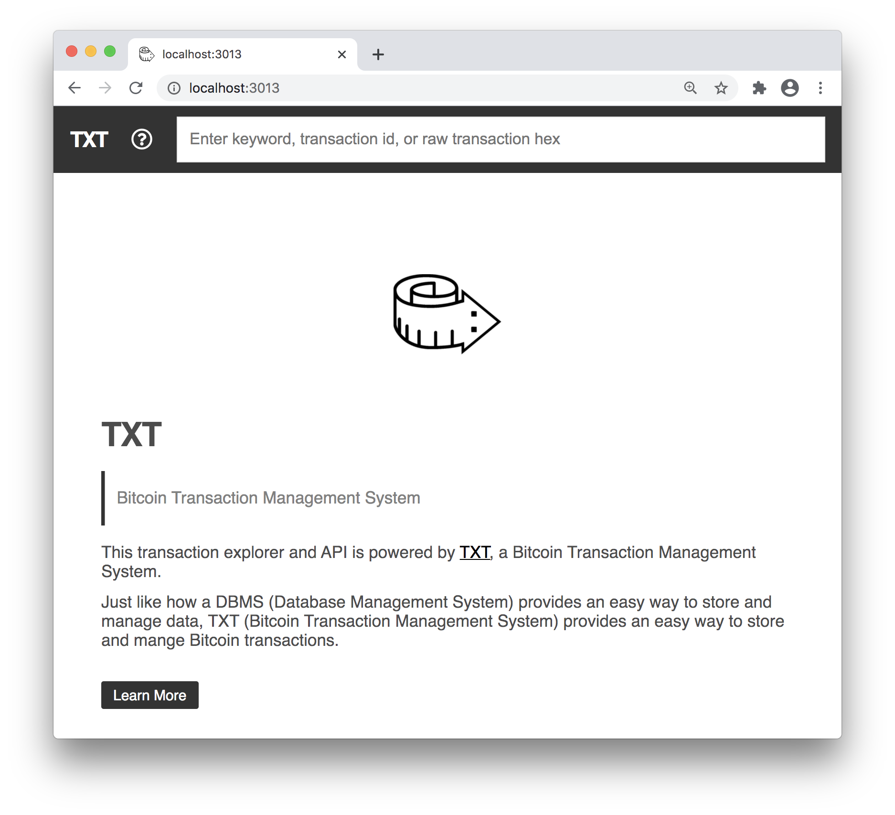

## 3. Write

### a. Transaction ID + Metadata

First, let's learn how to write to TXT. Try copy and pasting this and run it in your terminal:

```
curl -XPOST -H "Content-Type: application/json" -d '{"channel":"tester","set":{"5e696db21c57cef74c439ba2d30563e29c11f50f7c492fc0f653c6fa54a77c85":{"tags":["bitpic","bitcom"],"meta":{"title":"644@moneybutton.com","description":"bitpic for 644@moneybutton.com","content":"bitpic for 644@moneybutton.com\n\n  \n\n> https://bitpic.network/me/644@moneybutton.com","image":"https://x.bitfs.network/5e696db21c57cef74c439ba2d30563e29c11f50f7c492fc0f653c6fa54a77c85.out.0.3"},"data":{"paymail":"644@moneybutton.com","bitfs":"https://x.bitfs.network/5e696db21c57cef74c439ba2d30563e29c11f50f7c492fc0f653c6fa54a77c85.out.0.3"}}}}' http://localhost:3013/api
```

Basically it's making a POST request with a JSON payload which follows the TXT API convention.

Now check the browser at http://localhost:3013, you will see:

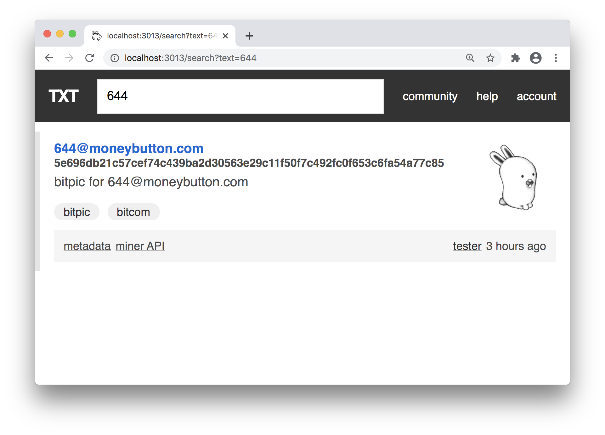

Here's an equivalent code in JavaScript, for those who want to try it as an app:

```javascript
const axios = require('axios')
axios.post("http://localhost:3013/api", {
  channel: "tester",
  set: {
    "5e696db21c57cef74c439ba2d30563e29c11f50f7c492fc0f653c6fa54a77c85": {
      tags: ["bitpic", "bitcom"],
      // 'meta' is used to display the card UI in the TXT explorer
      meta: {
        title: "644@moneybutton.com",
        description: "bitpic for 644@moneybutton.com",
        content: "bitpic for 644@moneybutton.com\n\n  \n\n> https://bitpic.network/me/644@moneybutton.com",
        image: "https://x.bitfs.network/5e696db21c57cef74c439ba2d30563e29c11f50f7c492fc0f653c6fa54a77c85.out.0.3"
      },
      // 'data' can be any arbitrary JSON, and will be included in all APIs.
      data: {
        paymail: "644@moneybutton.com",
        bitfs: "https://x.bitfs.network/5e696db21c57cef74c439ba2d30563e29c11f50f7c492fc0f653c6fa54a77c85.out.0.3"
      }
    }
  }
})
```

>  Note that this example only pushes the tranaction ID. If you want to push the full raw transaction, you can attach it as a `"rawtx"` attribute. This will be discussed in the next section.

And if you click through, you will land on the transaction page which looks like this:

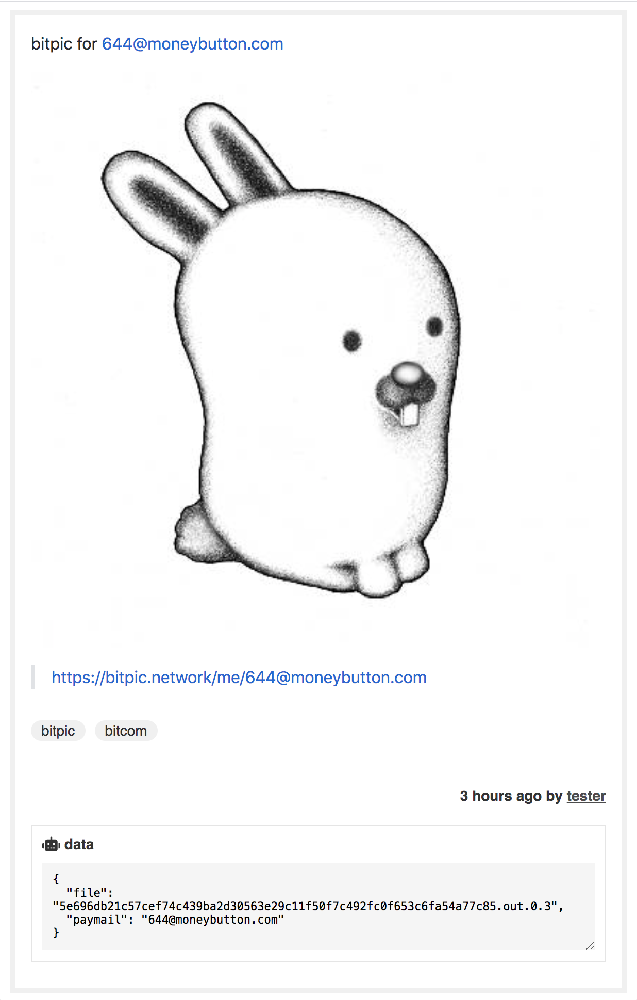

Let's walk through each item:

1. The card displays a markdown rendered version of the `meta.content` attribute.
2. The 2 tags "bitpic" and "bitcom" are correctly attached. Tags are used to organize transactions into multiple categories (one transaction can have multiple tags).
3. It says was posted 3 hours ago by "tester". This is because we specified `"channel": "tester"` when making the POST request. Unlike tags, a transaction can belong to only one channel.
4. The "data" field correctly contains the JSON payload we've attached. You can use the "data" field to attach arbitrary data which can be served as API.

Next on the right hand side, you'll see the following section:


This part is automatically populated by TXT by crawling the Miner Merchant API's [transaction status endpoint](https://minercraft.network/#/?id=_3-get-transaction-status). TXT automatically takes care of this so you don't have to worry about synchronizing with miners (powered by [Minercraft](https://minercraft.network))

> TXT only crawls miners until a transaction is mined into a block. Once a "status" merchant api check returns with a block hash and a block height, it stops retrying and caches the status as the final version of the transaction status.

So far we've looked at how you can store a transaction ID and attach semantic metadata. You may be wondering "Wait a minute, what's the point of only storing transaction IDs and not the full raw transactions?".

Here's why a transaction ID-only collection may be still useful:

1. **Transaction IDs as pointers:** When you "only" store transaction IDs, you are not losing anything as long as the transaction gets mined. In the future there will be multiple data service providers who will send you raw transactions when you ask with a transaction ID. Because a transaction ID is a hash of its corresponding raw transaction, you can validate such raw transactions you receive from the data service providers. You can think of it like a cloud drive service where not everything is always stored on your computer locally in order to save space, but you have the ability to synchronize from the cloud (such as iCloud) whenever needed.
2. **Information creates value from data:** A single transaction ID may not be useful, but a full comprehensive collection of semantically related transaction IDs may be very useful. For example, you may create and share a bundle of transaction IDs for a protocol. Or you may create a bundle of transaction IDs for multiple protocols merged into one. Each individual transaction id is not very valuable, but the collection as a whole is very valuable.
3. **Semantic Layer:** The ability to add a semantic metadata layer to transaction IDs is very powerful. You may store deserialized application specific metadata (such as Bitquery response format, or any arbitrary data representation format) along with transaction IDs.

### b. Transaction ID + Raw Transaction + Metadata

You can also store the full raw transaction hex in the DB. You simply need to:

1. Attach a "rawtx" attribute
2. Make sure the "rawtx" is the actual raw transaction for the transaction ID key (otherwise TXT will reject it).

Here's an example:

```javascript
const axios = require('axios')
axios.post("http://localhost:3013/api", {
  channel: "txt",
  set: {
    "3b46c28a8fcf20db39c166e58fa6bc98f39bc817b53a49b6df123973809fc83b": {
      rawtx: "0100000003b9e55d948f96fdcaea57df12e9f2b788de848f69397fd3e8ca2b4ae87159c44c010000006a4730440220498dac65ef1f8baaf623ae393549bcd01086d3b6a67e6b022eac4d8f2c37426902206f3214edaa640eb883fd9495f389799be05727bf362ad813511e0fc6835cbbc14121036536dcc473472cb4d87f9f08d2fd9afb69d6013bb12562eb96ccdbab18d98bf9ffffffff69082bf61d2dff44f1ad7ffee2de13db1aeaa6b0d2518606a3ab2b04dadfac9e030000006a47304402203a3eff15f6a8f2cc7384c51c52092fc27b6e70fe2b2b7c877dbb33285a41cce7022007c9848e0538d41877bd84ef1d14cbc990c4a9da8058a8e5196701ee6b53fd154121027b4c339a8f6fd22bb346c97942001fed57153c35a302f386db262ab144f2fd93ffffffffe4cfb6f1e110f22a56f7759fd95da2fd63839c0e30d45a5d1c41c10ac0424fa2020000006b483045022100ccb27f5828707cfd0e58b349d509b36d67e88762a667f0aae27cbab9a39279b2022063e5e21b98b438080a2a7e40c5bc6e480f02084c4bf848c5fc5866e2a6d049a24121027b4c339a8f6fd22bb346c97942001fed57153c35a302f386db262ab144f2fd93ffffffff04000000000000000056006a0c436974796f6e636861696e2029636974792061756374696f6e7c4d7572726179204272696467657c53746576657c32382e30305553441c61756374696f6e3230323030353238313032373134303033323337324f0f0400000000001976a9142c9f1612d2227ab1202a49f12f051b67dd462d3488ac8acd5000000000001976a9149111c7eb780aa4b1d670ab5cbdd4aed93824d37588aceb49df00000000001976a9147584588137a124914dfa355ba40aa37cd724c6c588ac00000000"
      tags: ["cityonchain"],
      // 'meta' is used to display the card UI in the TXT explorer
      meta: {
        "title": "Murray Bridge",
        "description": "Steve",
        "content": "Murray Bridge Steve 28.00USD auction 202005281027140032372
      },
      // 'data' can be any arbitrary JSON, and will be included in all APIs.
      data: {
        location: "Murray Bridge",
        name: "Steve",
        timestamp: 202005281027140032372
      }
    }
  }
})
```


## 4. Read

Finally, let's check out what the machine readable API for this transaction looks like. Scroll up to the top and click the "API" button at the top left corner. You will see the following JSON:

```json
{
  "result": {
    "tx_id": "5e696db21c57cef74c439ba2d30563e29c11f50f7c492fc0f653c6fa54a77c85",
    "data": {
      "file": "5e696db21c57cef74c439ba2d30563e29c11f50f7c492fc0f653c6fa54a77c85.out.0.3",
      "paymail": "644@moneybutton.com"
    },
    "meta": {
      "title": "644@moneybutton.com",
      "content": "bitpic for 644@moneybutton.com\n\n  \n\n> https://bitpic.network/me/644@moneybutton.com",
      "url": "https://bitpic.network/me/644@moneybutton.com",
      "image": "https://x.bitfs.network/5e696db21c57cef74c439ba2d30563e29c11f50f7c492fc0f653c6fa54a77c85.out.0.3",
      "description": "bitpic for 644@moneybutton.com"
    },
    "message": null,
    "username": "tester",
    "tags": "bitpic,bitcom",
    "id": "5e696db21c57cef74c439ba2d30563e29c11f50f7c492fc0f653c6fa54a77c85",
    "status": {
      "payload": {
        "apiVersion": "0.1.0",
        "timestamp": "2020-05-15T19:24:09.041Z",
        "returnResult": "success",
        "resultDescription": "",
        "blockHash": "00000000000000000500b001439f755e2745ba6ec0fe442ab5cf9aaadc683372",
        "blockHeight": 609365,
        "confirmations": 25697,
        "minerId": "03e92d3e5c3f7bd945dfbf48e7a99393b1bfb3f11f380ae30d286e7ff2aec5a270",
        "txSecondMempoolExpiry": 0
      },
      "signature": "3045022100d5311634cf1ffdb79bd23b601ca6b7955b22da6c0bb119eb62bd7e76bf0a3a660220028de285abdb1bf72d824ea9c09ec76b0ac28868658a18447a5b71a7a24921d2",
      "publicKey": "03e92d3e5c3f7bd945dfbf48e7a99393b1bfb3f11f380ae30d286e7ff2aec5a270",
      "encoding": "UTF-8",
      "mimetype": "application/json",
      "valid": true
    },
    "created_at": "3 hours ago"
  }
}
```

There's not much to explain here since you simply need to fetch that URL to access the GET API. And that's it!

Note that every page on the TXT explorer has an API button at the top so you should be able to easily figure out how to use them.

As you can see, the response contains everything you've programmatically pushed earlier ("tags", "data" and "meta") as well as some additional information such as "status", which is the cached version of the miner merchant API response. 

Making use of these APIs should be straightforward since these are just simple JSON objects or arrays.


## 5. What Next?

To learn more about the APIs in detail, read [API Reference](#api-reference).

To learn some potential use cases, check out the [use cases section](#use-cases).

To contribute to this documentation page, check out [GitHub](https://github.com/interplanaria/txt.network).

To ask questions and share ideas and modules, [join the chat](https://t.me/joinchat/RDiQsxxVwpFx-TDbD4tt8A).

---

# API Reference

Once you have your TXT running, you can start pushing transactions into it with additional metadata, and TXT will store and index them all in realtime. Then you can browse and organize all your transactions from any web browser.

## 1. Write

Writing to TXT is as easy as making a POST request. 

There is only a single API endpoint `/api` where you make POST requests to, but with just this simple syntax you can achieve a lot.

Here's an API example:

```
POST /api HTTP/1.1
Host: localhost:3013
Content-Type: application/json
token: <Your TXT auth token>

{
  channel: <channel_to_post_to (optional. the default value is 'txt')>,
  set: {
    <transaction id>: {
      tags: [<tag1>, <tag2>, ...],
      rawtx: <raw transaction (optional. if specified, it will store the entire raw transaction to the TXT db. can be used for BIP270)>,
      meta: {
        title: <the title that represents a card>,
        description: <the description displayed for a card>,
        image: <the preview image to display for a card>,
        link: <the reference link to display for the transaction>,
        content; <markdown content to display on the transaction post apge>
      },
      data: <Any arbitrary JSON data. This can be parsed by machines>
    }
  }
}
```

And this is all there is to it! 

Let's walk through the payload specification and how each attribute corresponds to the explorer UI.

First, here's what some of the attributes correspond to in the explorer list view:

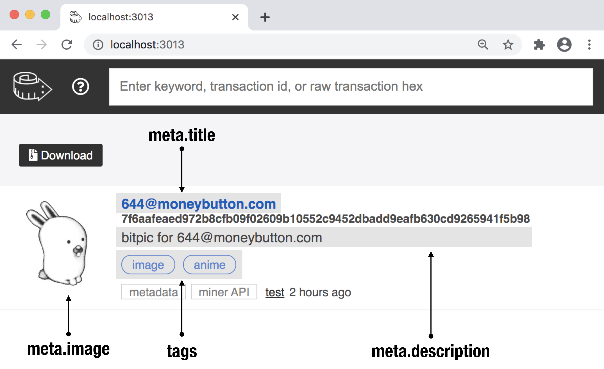

And here's what they correspond to in a detail view:

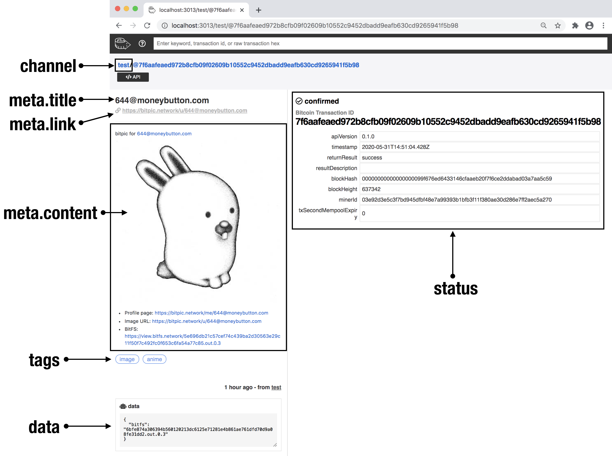

When making a POST request, there are up to 2 root level attributes to the JSON payload: **channel** and **set**.

Using the **set** command, you can treat TXT like a key/value database. 

And using the **channel** attribute, you can namespace each key value database.

1. **channel (optional):** A channel is an independent compartmentalized workspace for storing transactions.
   - You can use it to implement categories, or account systems. 
   - each channel cannot have duplicate transaction IDs. If you need to store different metadata for a single transaction ID, create another channel and store it there.
   - If you don't specify it, TXT will automatically store all transactions to the default channel named "txt".
1. **set:** Think of the "set" command as a way to "set" payload for a given transaction ID. It's like a key/value database where the key is the transaction ID. 
   1. **<transaction id>**: The top level attribute is the transaction ID. You need to specify the transaction ID you wish to insert or update.
      1. **tags:** This is the important part that makes TXT unique and powerful. Just by attaching tags to your transactions you can organize them into as many categories as you want. And because it's powered by tags, a transaction can belong to multiple categories. Each tag has its own dedicated landing page as well as its own dedicated GET API endpoint. **`tags` are incorporated into full text search along with all attributes of `meta`.**
      2. **rawtx:** optional. If you have a raw transaction hex, you can push it to TXT to store the full raw transaction on the TXT database. If this field is left empty, TXT will only store transaction IDs and its metadata. rawtx is useful for various use cases including BIP270 approach to building applications.
      3. **meta:** The meta attribute is used for describing human readable metadata about a transaction item. The TXT explorer will use this information to render transaction items as well as create **a full text index**.
         1. **title:** The title attribute is displayed as the title of a card in a list view.
         2. **description:** The description attribute will be displayed in a description part of a card in a list view.
         3. **image:** preview image for a card in a list view.
         4. **link:** You can set a reference link for a transaction item. This will be prominently displayed on a transaction landing page. If you are using TXT as your app search engine, use this attribute to link to the app's permalink for the corresponding transaction ID (For example for [bitpic search engine](https://txt.bitpic.network), we may set the link attribute as https://bitpic.network/me/644@moneybutton.com for transaction ID [2254c5c5a6e3ce906bf69ba59bdde039f68a80e45b22e7a1c23aa3d7c6c447f4](https://txt.bitpic.network/txt/@2254c5c5a6e3ce906bf69ba59bdde039f68a80e45b22e7a1c23aa3d7c6c447f4), so that users can search for a transaction ID and then be directed to the app's landing page for the transaction).
         5. **content:** a full fledged markdown content tied to each transaction. You can see this on a transaction landing page.
      4. **data:** Arbitrary machine processable data. You can attach any arbitrary JSON payload under this attribute. This will then be available through READ API.

## 2. Read

Even with a simple structure, TXT provides an API which can be as flexible as you make it.

At the core of TXT APIs are two concepts:

1. Channels
2. Tags

### a. Channels

Channels are independent workspaces for storing transactions.

There are many ways in which you can utilize this feature. Some examples;

1. **Account system:** Store transactions compartmentalized into user accounts. For example, for your bitcoin app user "alice@moneybutton.com", you can store all her transactions under `/alice@moneybutton.com` channel.
2. **Categories:** Organize transactions into categories. For example, you can categorize all "post" transactions under `/post`, and comment transactions under `/comment`.

By default all transactions are stored to a default channel named "txt", but you can start posting to other channels simply by specifying the channel name when you make API requests.

Normally you won't need to create multiple channels and just use the default "txt" channel for everything thanks to the powerful tagging feature (explained in the next section), but you can get creative and build very sophisticated organization structure through channels when you need to.

All API feeds will be prefixed with the channel name.

```
/<channel_name>
```

To get all the recent transactions for a channel as JSON, you can fetch:

```
/<channel_name>/json
```


### b. Tags

Channels are great but cannot represent many-to-many relationships, meaning a single transaction cannot belong to multiple channels. What if you want a transaction to have multiple parents? Meet tags.

For example, you can tag an image transaction as `image`, `jpg`, `file`, etc.

The tag system basically gives you an instant ["many-to-many" data structure](https://en.wikipedia.org/wiki/Many-to-many_(data_model)) out of the box, without you having to do anything.

The system is already built-in, so all you need to do is follow the convention and organize your transactions into tags. Then you can consume the tag feed under:

```
/<channel_name>/<tag_name>
```

If you want a JSON API for the tag feed at:

```
/<channel_name>/<tag_name>/json
```

### c. Queries

TXT has the following query modifiers which can be combined with the above APIs:

1. **limit:** limit the number of items to return
2. **offset:** set the start offset from which to return items (used for pagination)
3. **order:** set the sort order. supported values:
	- `order=i`: ascending sort by block height
	- `order=-i`: descending sort by block height
	- `order=created_at`: ascending sort by insertion time (when a transaction was inserted into TXT)
	- `order=-created_at`: descending sort by insertion time
4. **from:** filter the results to those after block height X
   - `from: 636379`: from (including) block height 636379
5. **to:** filter the results to those until block height X
   - `to=636370`: to (including) block height 636370
   - `from=636360&to=636361`: from 636360 to 636361
6. **at:** filter the results to those with exactly block height X
   - `at=636379`: Only transactions at block height 636379
   - `at=null`: all transactions with block height of null (**unconfirmed transactions**)
   - `at=-null`: notice the `-` in front of `null`. all transactions whose block height is NOT null (**confirmed transactions**)


Here are some examples:

- `/planaria/bitpic?limit=100`: Return 100 transactions from `planaria` channel, tagged with `bitpic`
- `/planaria/bitpic?limit=100&offset=100`: Return 100 transactions from the offset 100 (from 100th to 200th) from `planaria` channel, tagged with `bitpic`.
- `/planaria/bitpic?limit=100&order=i`: return the earliest 100 transactions ('order=i' means ascending sort by height, meaning start from the lowest height)
- `/planaria/bitpic?limit=1&order=-i`: return the most recent 1 transaction ('order=-i' means descending sort, so the first item will be the most recent one)
- `/planaria/bitpic?from=560000&to=560010`: return all transactions from `planaria` channel tagged with `bitpic`, between block height `560000` and `560010`
- `/planaria/bitpic?at=600000`: return all transactions from `planaria` channel tagged with `bitpic` at height `600000`.

### d. Transactions

Transactions are prefixed with `@`. 

```
/<channel_name>/@<transaction_id>
```

For example, you can access transaction ID "21542bead57292a0b39d0beacb6d12672bf01ce5d883b93cbc270464a34fc265" stored under Alice's channel by hitting:

```
/alice/@21542bead57292a0b39d0beacb6d12672bf01ce5d883b93cbc270464a34fc265
```

### e. Global Feed

So far we have assumed queries tied to a single channel. However you can get the entire global feed of the TXT storage.

Instead of specifying a specific channel name, you can use `"_"`.

For example to get the global feed of "image" tags, you can request:

```
/_/image
```


---

# Use cases

## 1. Blockchain Filter Cache

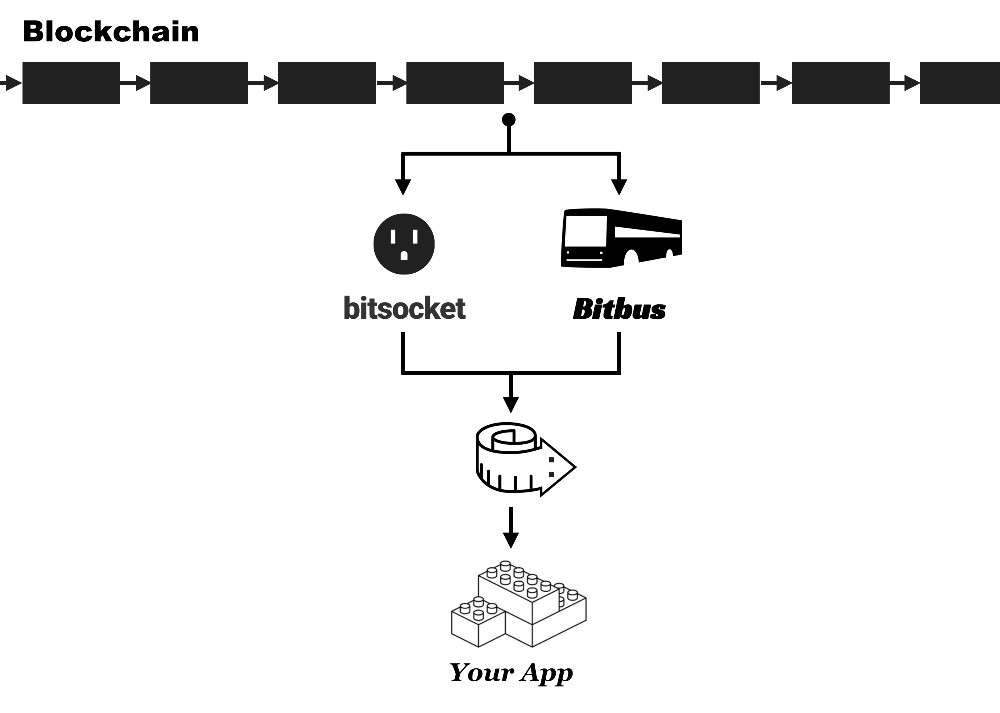

You can use TXT as your own blockchain filter cache. Use Bitbus or Bitsocket to filter data and pipe the data to your TXT in realtime.

Once the data is stored on TXT, you can:

1. Use it for your apps by crawling TXT
2. Provide the API as a service to others
3. Provide the explorer UI as a service to others
4. Store it as backup
5. Let others download the entire TXT so they can run a replica TXT node

The TXT.db format is a single file, which means it's as fast as downloading any other file over the internet. Even if the TXT tape is GB in size, it should only seconds to download if you have good Internet connection (This is not the case if you try to download this over API responses). And once you have downloaded the TXT.db, you can run it even without an Internet connection because it's stored locally.

TXT is your bitcoin transaction cache. 

## 2. Peer to Peer Apps (BIP270)


TXT is lets you easily build apps using the newly emerging approach of "Wallet-to-Wallet" approach (previously known as "BIP270").

You can learn more about the approach in the following articles:

- https://medium.com/@handcash/bringing-back-peer-to-peer-to-bitcoin-a-joint-announcement-by-handcash-and-money-button-e2b25b71dd9d
- https://blog.moneybutton.com/2020/03/30/handcash-and-money-button-restore-peer-to-peer-electronic-cash/

So how does TXT fit into this picture?

It's actually very simple. As an app developer, you would be probably using various Bitcoin wallets or transaction building libraries such as bsv.js. And these wallets probably have APIs that trigger after a transaction has been successfully sent (for example, moneybutton's `onPayment()` callback). You can take the transaction ID (or raw transaction) from the callback and POST it to your TXT, along with whatever semantic metadata you want to attach.

## 3. Search Engine for Your App

Simply by caching all your app related transactions into TXT, you can instantly have your own app search engine and transaction explorer.

You can either use it privately for admin purposes, or you can open it up to all your app users to search your app transactions easily.

Having a transparent transaction explorer / search engine is very valuable for building user trust, and is also valuable for your users.

Many application users have trouble finding various bitcoin app transactions they have uploaded to the blockchain because there's no easy way to keep track of them. As the app developer, YOU can be the one to help your users so your users never lose their transactions, and therefore truly "own their data".

## 4. Portable Transaction ID Bundle

The key to "owning your data" is owning your own transaction IDs. Even if you don't store the raw transactions today, you can always fetch them later in the future as long as you have the transaction IDs.

TXT makes this easy. Simply store the transaction IDs to TXT along with semantic metadata such as tags and full text description so you can search and browse, and programmatically access the transactions easily later.

In the future there will be a market for txid to raw transactions, and as long as such a market exists, users will be able to store their data for the lowest cost possible.

Lastly, since these transaction id bundles are stored as portable SQLite files, this doesn't require relying on any 3rd party.

## 5. Offchain Transaction storage

TXT can act as a buffer. You can store transactions offchain before broadcasting to:

1. **Miners:** store transactions before sending to miners.
2. **Bitcoin  network:** store transactions locally and broadcast to the bitcoin network later.
3. **User peers:** store transactions locally and send to other users later.

You can also store various transaction templates by POSTing to TXT, and later reusing them by fetching through the GET API.

The transactions may be signed or unsigned, broadcasted or pre-broadcast, there are no limits. Use your imagination.

## 6. More

There are many more ways to use TXT, and it all depends on how YOU use it.

Come join the discussions in the developer chatroom: https://t.me/joinchat/RDiQsxxVwpFx-TDbD4tt8A


---

# Advanced

The TXT container has a default configuration which makes it easy to get up and running very quickly.

However you may want to learn how to customize the settings if you want more flexibility and security.

Let's walk through how the environment variables work. First here's what the default `docker-compose.yml` looks like:

```yaml
version: '3.5'
services:
  txt:
    image: planaria/txt:0.0.1
    stdin_open: true
    volumes:
      - ./mnt:/root/mnt
    environment:
      - NAME=
      - DESCRIPTION=
      - MINER_URL=https://merchantapi.taal.com
      - TOKEN=
    ports:
      - "3013:3013"
    networks:
      - txt
    logging:
      driver: "json-file"
      options:
        max-size: "100m"
networks:
  txt:
    name: txt
```

The attributes to note are:

- **environment**
  - **NAME:** name of the TXT repository. shoows up on the explorer web app's meta tag
  - **DESCRIPTION**: description of the TXT repository. shows up on the explorer web app's meta tag
  - **MINER_URL:** Merchant API root path. Learn more here: https://github.com/bitcoin-sv-specs/brfc-merchantapi
  - **TOKEN**: API Token for making POST requests to TXT. By default it's empty, which allows anyone to write to TXT. When running TXT in production, you may want to set your own secret token here. Then you will need to set the **"token"** attribute in the header whenever you make POST requests to TXT.
- **ports**
  - by default TXT uses the port 3013. you can configure the exposed port by modifying this part. Learn more here: https://docs.docker.com/compose/compose-file/#ports

Here's an example:

```yaml
version: '3.5'
services:
  txt:
    image: planaria/txt:0.0.5
    stdin_open: true
    volumes:
      - ./mnt:/root/mnt
    environment:
      - NAME=c.txt
      - DESCRIPTION=Bitcoin content addressable file system search engine
      - MINER_URL=https://merchantapi.taal.com
      - TOKEN=852a6f54d6406855721a31bd8cd00f36f4d54d2fcb85d41a410a1c58544db0d0
    ports:
      - "3013:3013"
    networks:
      - txt
    logging:
      driver: "json-file"
      options:
        max-size: "100m"
networks:
  txt:
    name: txt
```
